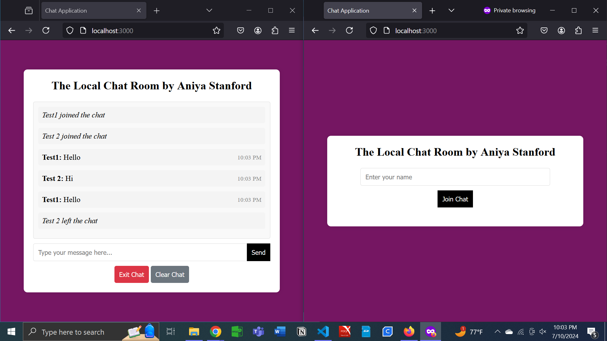

# Local Private Chat Room

## Description
This project is private local chat room.

## Table of Contents
- [Installation](#installation)
- [Usage](#usage)
- [Features](#features)
- [Contributing](#contributing)

## Installation
1. Clone the repository:
   ```bash
   git clone https://github.com/username/repository-name.git
2. Navigate to the project directory:
    ```bash
   cd repository-name
4. Install dependencies:
    ```bash
   npm install

## Screenshots

### Interface:


### Joining Chat:


### Example:


### Example of Leaving Chat:


## Usage
This is a simple private chat room.

## Contributing
If you have any ideas for improvements or new sections that could be added to the chat room, feel free to share insight. Constructive feedback and ideas are always appreciated.
